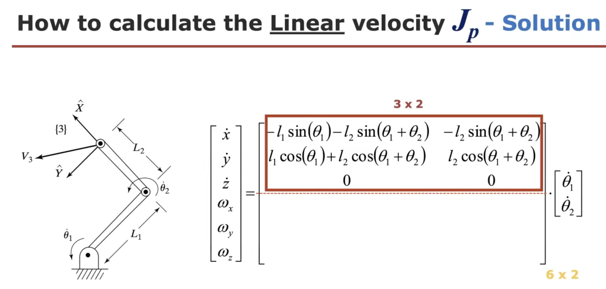
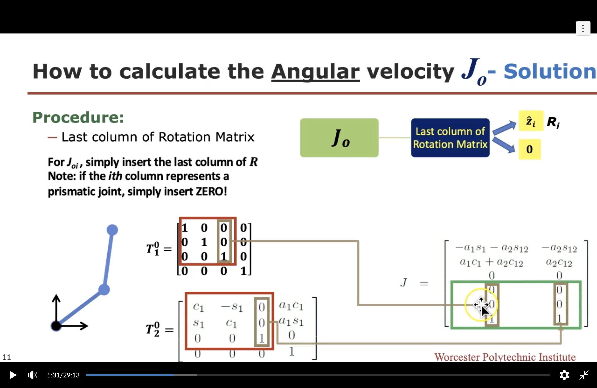
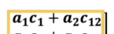
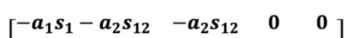
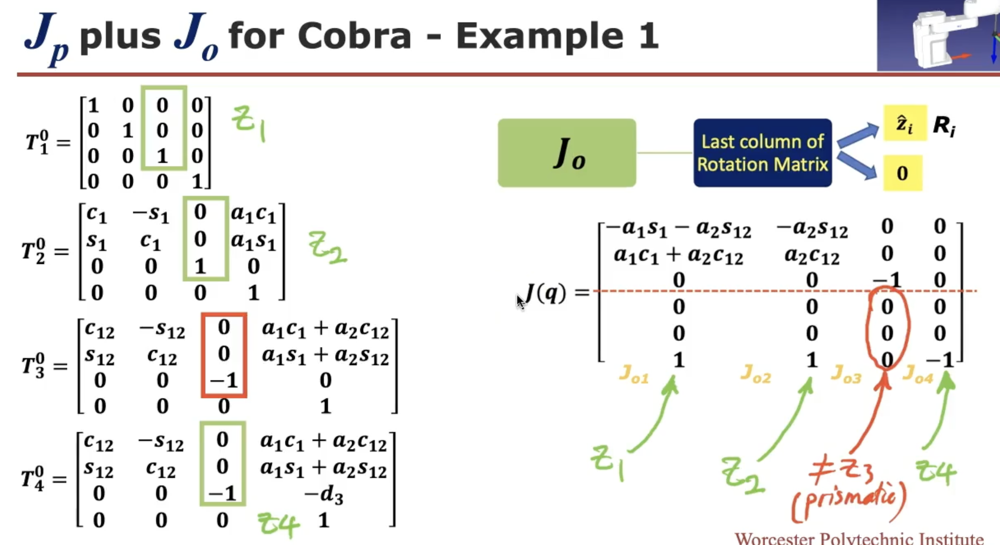
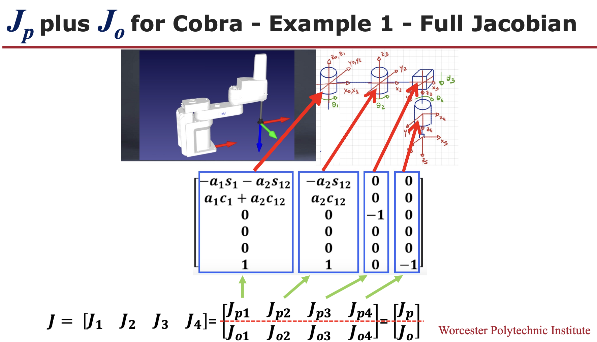
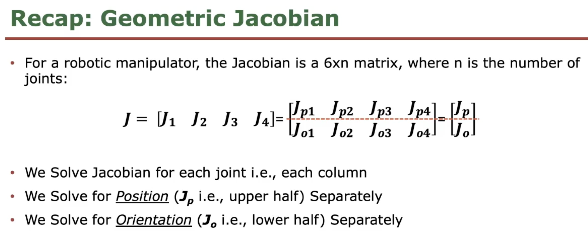
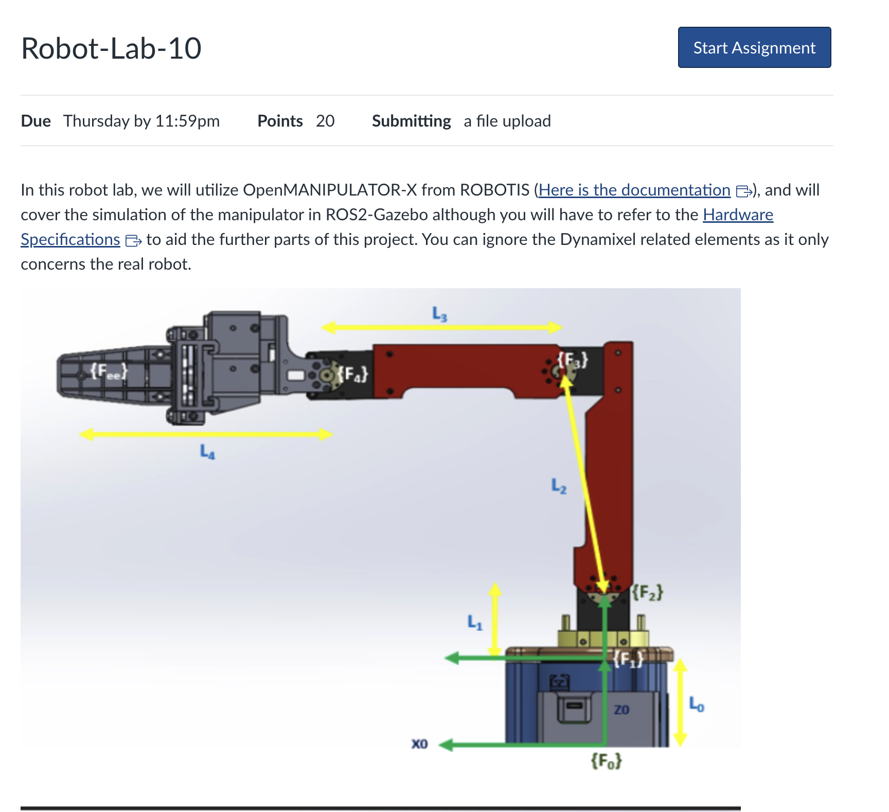
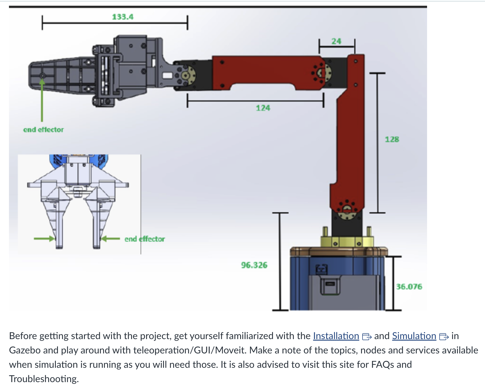
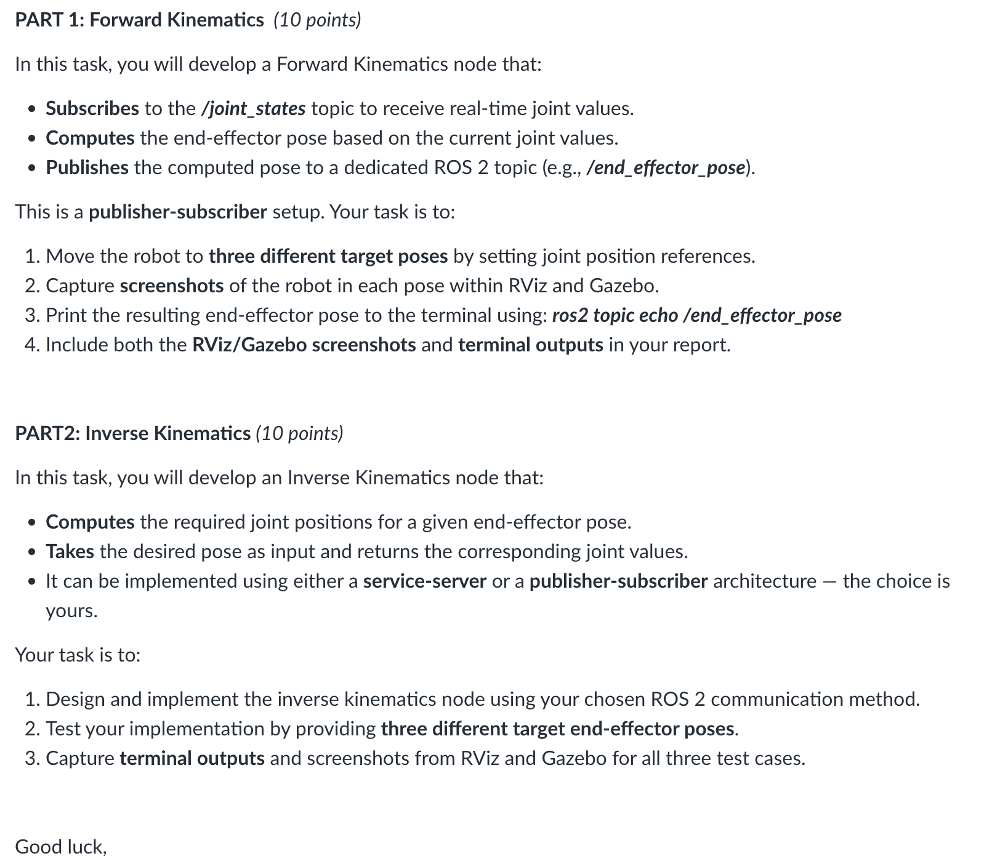

## Week 10 Overview
### Topic Description
This week, our focus will continue on exploring the Velocity Kinematics (VK), delving deeper into the intricacies of Differential Kinematics and the derivation of the Geometric Jacobian matrix using the Linear and Angular velocities. We will specifically examine how these concepts apply to under-and-over-actuated manipulators, shedding light on their operational dynamics. Furthermore, our journey will encompass a thorough investigation into Velocity Manipulability Ellipsoids, providing a comprehensive understanding of how manipulators interact with and manipulate velocity within their operational space.

At the end of this course week, you will be able to:
Compute the Linear and Angular Velocities Jacobians of a serial-arm manipulator
Derive the Forward and Inverse Velocity Kinematics for under- and over-actuated manipulators
Find the velocity manipulability ellipsoids of a manipulator
To Read:
Chapter 5 [5.1 - 5.8] - Craig's book (pp. 117-121)
Chapter 3 [3.1 - 3.6] - Bruno's book (pp. 105 - 158)
Supplementary video materials
https://www.youtube.com/playlist?list=PLggLP4f-rq00oA7lrv6dS5C15RYjqj4ZiLinks to an external site.

### Lecture Content

This week, our focus will continue on exploring the Velocity Kinematics (VK), delving deeper into the intricacies of Differential Kinematics and the derivation of the Geometric Jacobian matrix using the Linear and Angular velocities. We will specifically examine how these concepts apply to under-and-over-actuated manipulators, shedding light on their operational dynamics. Furthermore, our journey will encompass a thorough investigation into Velocity Manipulability Ellipsoids, providing a comprehensive understanding of how manipulators interact with and manipulate velocity within their operational space.

####

This week teach us How to obtain J (mathematical derivation) compare to week9

黄色框出的部分 → 末端执行器的位置 
The first row on the right shows the partial derivatives with respect to the variables that can vary from joint to joint.
 First row ->   -> 

移动关节 (prismatic) 0：零向量，因为平移关节没有角速度贡献

### Lab10:

Installation:
choose humble branch

https://emanual.robotis.com/docs/en/platform/openmanipulator_x/quick_start_guide/#install-ros-packages

refer from section 4.1.4:
open an command window:
use_ros2

simulation: 
https://emanual.robotis.com/docs/en/platform/openmanipulator_x/ros_simulation/#launch-gazebo
