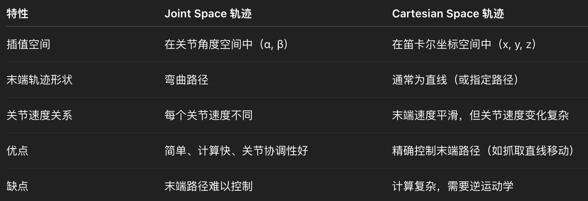
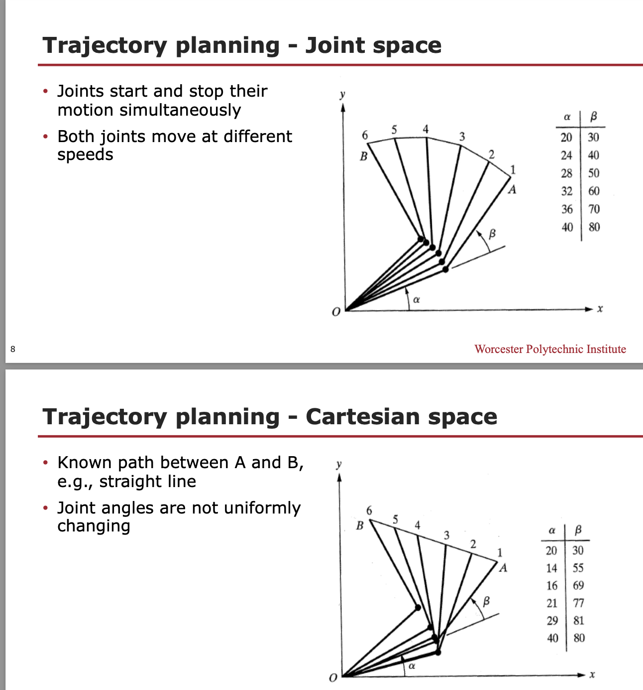
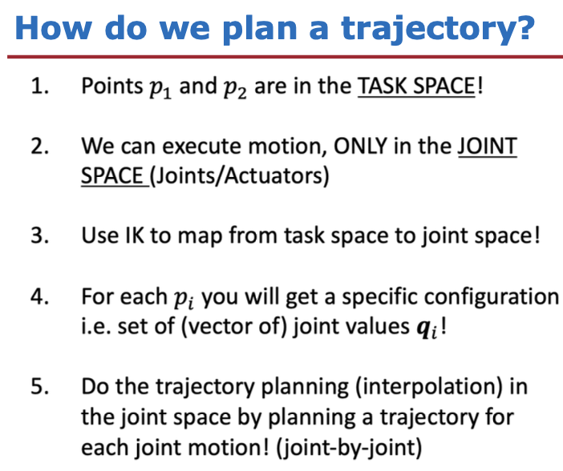
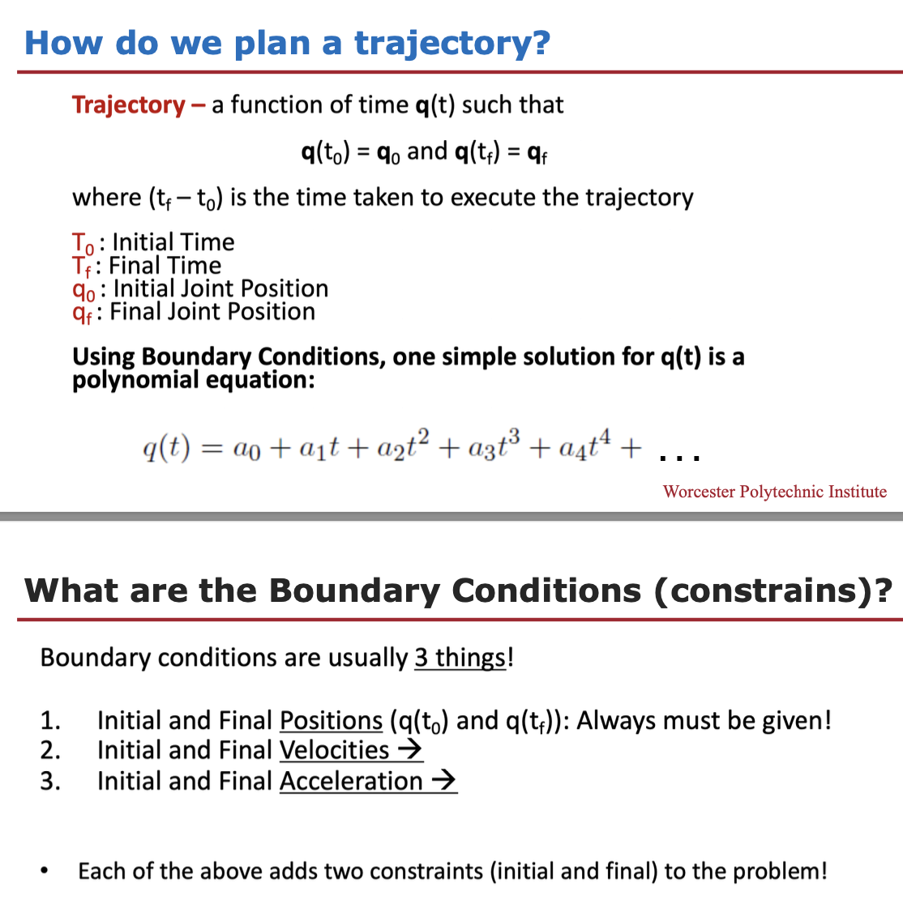

## 
This week, we will explore methods of computing trajectories that describe the desired motion of a serial-arm manipulator in multidimensional space. Also, we will look at how to generate trajectories and how to find the right coefficients that describe them. Finally, we will embark on a journey into the world of Computer Vision, starting with a comprehensive exploration of Image Processing and Analysis.

##
At the end of this course week, you will be able to:
Generate trajectories in Joint and Cartesian space
Find the constraints of a trajectory
Derive the coefficient of a cubic polynomial that describes a trajectory
Process and analyze images

####

