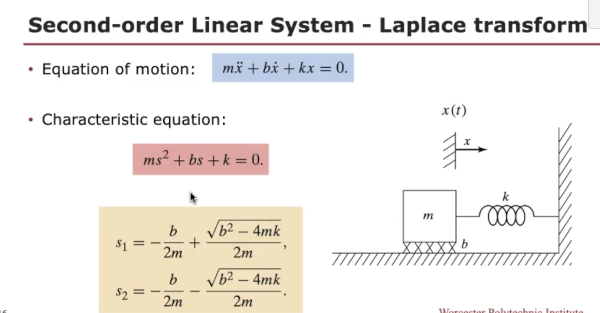

## 
This week, Our focus will be on executing these desired motions from a control perspective. The control techniques we will explore belong to a category known as linear control systems, where the system under examination can be mathematically modeled using linear differential equations. It's important to note that in manipulator control, these linear methods should be primarily considered as approximations. 

##

