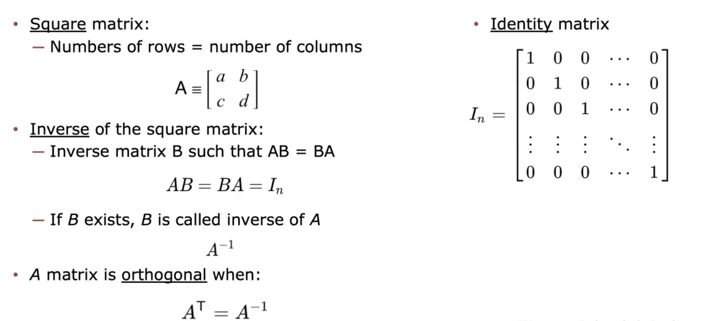
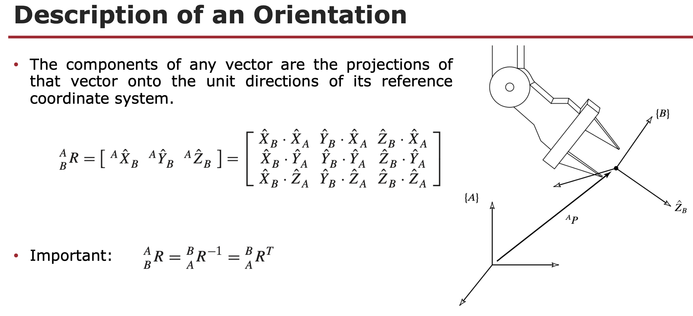

# Week 2 – Sensors, Actuators, and Coordinate Frames

## Topic Description
This week's focus revolves around a comprehensive exploration of the pivotal components in robotics: **actuators and sensors**. We will study the details of these essential elements that play a crucial role in robot functionality and perception.  

Additionally, we extend into **Linear Algebra fundamentals** for robotics, covering Matrices, Vectors, Cartesian Coordinate Systems, and Frames. This knowledge is foundational for understanding the mathematical underpinnings that empower robotic operations and control.

## Learning Outcomes
By the end of Week 2, I should be able to:
- Recognize different types of actuators and sensors used in robotics  
- Perform basic matrix and vector operations  
- Describe a point relative to a frame  
- Perform operations with **MATLAB** programming platform  

## To Read
- Bruno’s Book: Chapter 5  
- Craig’s Book: Chapter 2 (Sections 2.1 – 2.4)  

## Lecture Highlights
### Transducers
- **Definition**: devices that convert energy from one form to another.  
- Categories: actuators, sensors, bidirectional transducers, transceivers.

### Actuators
- **Linear vs. Rotary** motion.  
- **Types**:
  - DC motors (brushed, brushless, stepper)
  - Servo motors
  - Pneumatic actuators
  - Soft actuators
  - Hydraulic actuators
  - Piezoelectric actuators
  - Series Elastic Actuators (SEA)
  - Underactuated systems

### Sensors
- **Proprioceptive** (internal): encoders (used to measure the position of the joints), joint torque, accelerometers, gyroscopes.  
- **Exteroceptive** (external): cameras, LiDAR, infrared, sonar.  
- Important aspects: calibration, accuracy, home position.

### Linear Algebra Refresher
- Matrices: transpose, inverse, identity, orthogonality.

[Lecture 2 Notes (PDF)](Lecture-2-RBE-500-1.pdf) : important from page 46 to the end.

- Vectors: magnitude, dot product, cross product.
- MATLAB examples for matrix inverse, transpose, dot, cross.

### Frames & Mappings
- Cartesian coordinate system: universal reference frame.
- Description of position (3×1 vector) and orientation (rotation matrices).
- Definition of a **frame**: position + orientation.
- Mapping:
  - Translated frames
  - Rotated frames
  - General frames
- Homogeneous transformations (4×4 matrices).
- MATLAB implementation of mapping and transforms.

## To Read
- Bruno’s Book: Chapter 5  
- Craig’s Book: Chapter 2 (Sections 2.1 – 2.4)  

## Robot-Lab 2
- **Task**: Install ROS2 Humble and configure environment.  
Since ROS2 often requires multiple terminals, there is one tool that can open multiple terminals within the same GUI. It's called Terminator:

$sudo apt-get install terminator
- Verify with `ros2 run demo_nodes_cpp talker` and `listener`.  
- Install useful packages (`colcon`, `rviz2`, `gazebo-ros-pkgs`, etc.).  

## Quiz 2 Focus
