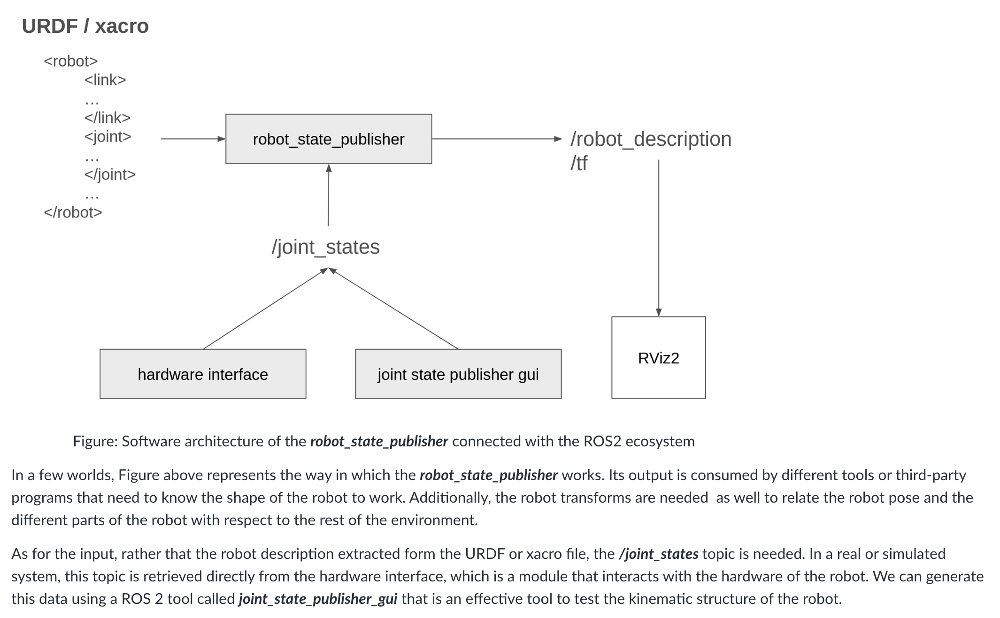
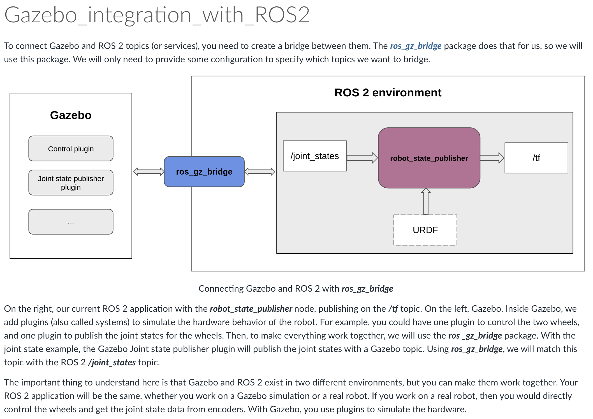

This week, we will delve into the fundamental concepts of linear and angular velocity of rigid bodies, utilizing them to analyze the motion of a manipulator through Velocity (Differential) Kinematics. Additionally, we will be introduced the Jacobian (J) matrix, a crucial entity in robotics, laying the groundwork for solving specific problems. Forward Velocity Kinematics (VK) explores the relationship between joint and end-effector velocities, crucial for tasks like motion planning. The Jacobian matrix maps these velocities, with Kinematics Singularities highlighting configurations where control may be challenging. Inverse Velocity Kinematics (IVK) solves for joint velocities to achieve desired end-effector velocities. Finally, we will master these concepts in practical application using MATLAB and the Robotics Toolbox (RTB).

diff between before and now. 

in the past we studied FK IK for caculate the position of end effector. 

now we are learning how to control the rate/velocity of the end effector.

This expresses how to change the reference frame for a Jacobian.

Robotics
Jacobian not invertible
Velocity control impossible in some directions

## Robot-Lab-9
In this robot lab, we will be introduced to the robot_state_publisher node which is a crucial component in robot systems, providing a standardized way to communicate the state of the robot's kinematic structure to other nodes. Afterward, we will learn how to spawn a robotic model in the Gazebo SimLinks to an external site., which is a 3D simulation engine that contains a physics engine (with gravity, friction, and other physical constrains) with which you can simulate a robot, just like if it were in the real world.

Publish Robot Model:
https://docs.ros.org/en/humble/Tutorials/Intermediate/URDF/Using-URDF-with-Robot-State-Publisher-py.html

Links to an external site. install gazebosim fortress
https://gazebosim.org/docs/fortress/install_ubuntu/Links 

for install and use gazebo
follow these 2 docs: 
https://docs.ros.org/en/humble/Tutorials/Advanced/Simulators/Gazebo/Simulation-Gazebo.htmlLinks to an external site.

https://docs.ros.org/en/humble/Tutorials/Advanced/Simulators/Gazebo/Gazebo.htmlLinks to an external site.

then follow this doc finish the lab
The Gazebo Fortress tutorials below offers guides on building and simulating robots, using the GUI, integrating with ROS 2, and working with Gazebo’s core libraries. 

https://gazebosim.org/docs/fortress/tutorials/Links to an external site.
Spawn the PUMA560 robotic manipulator Models in Rviz2 and Gazebo. Build the URDF from scratch or use the available /robot_description from the sources below (example):

https://github.com/nimasarli/puma560_descriptionLinks to an external site.

### submit: 
Begin the simulation in Gazebo by pressing the bottom left "Play" button. See how gravity exerts its influence on the joints of the manipulator, causing them to descend towards the ground.

Note: Please do not add any ros2_control package in the robot description as it locks the motor joints when you run the Gazebo simulation.

Upload a video of your PUMA560 model manipulations in Gazebo simulation, and submit the urdf-or-xacro file. (10 points) 

