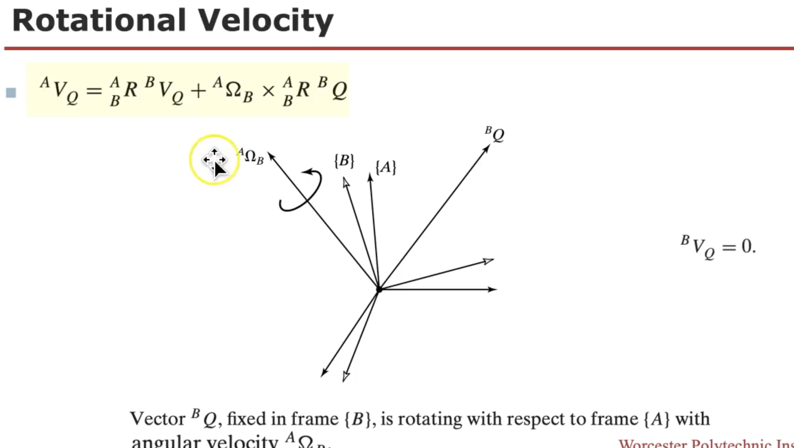
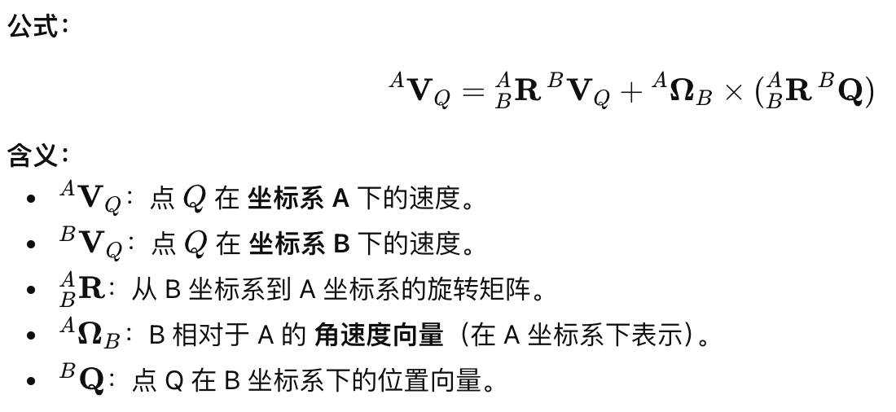
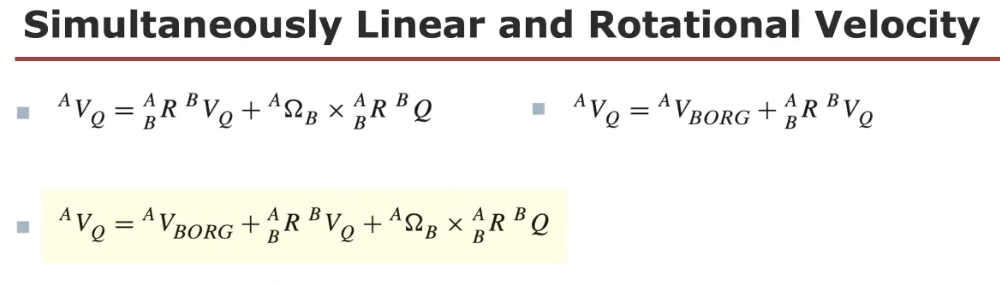
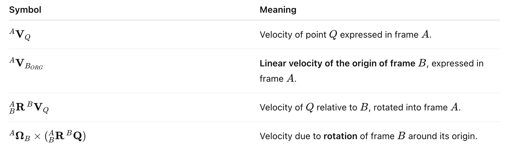
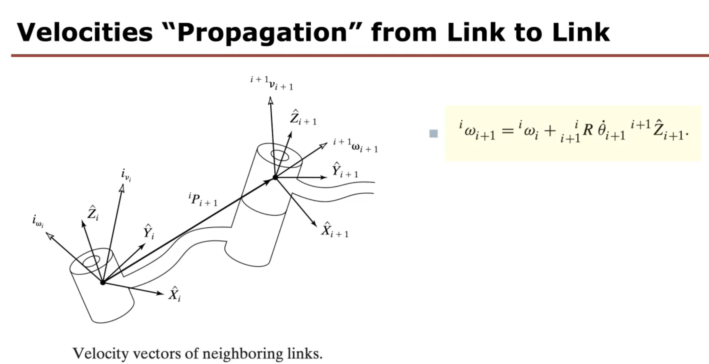
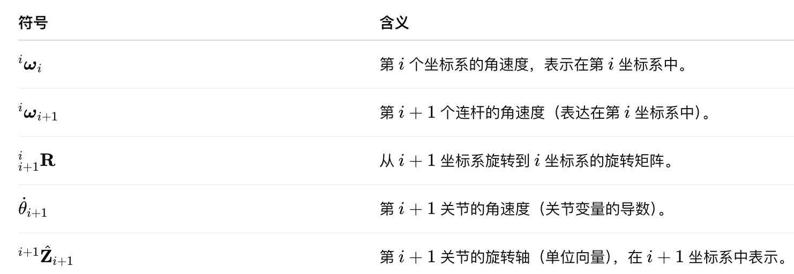

This week, we will delve into the fundamental concepts of linear and angular velocity of rigid bodies, utilizing them to analyze the motion of a manipulator through Velocity (Differential) Kinematics. Additionally, we will be introduced the Jacobian (J) matrix, a crucial entity in robotics, laying the groundwork for solving specific problems. Forward Velocity Kinematics (VK) explores the relationship between joint and end-effector velocities, crucial for tasks like motion planning. The Jacobian matrix maps these velocities, with Kinematics Singularities highlighting configurations where control may be challenging. Inverse Velocity Kinematics (IVK) solves for joint velocities to achieve desired end-effector velocities. Finally, we will master these concepts in practical application using MATLAB and the Robotics Toolbox (RTB).

